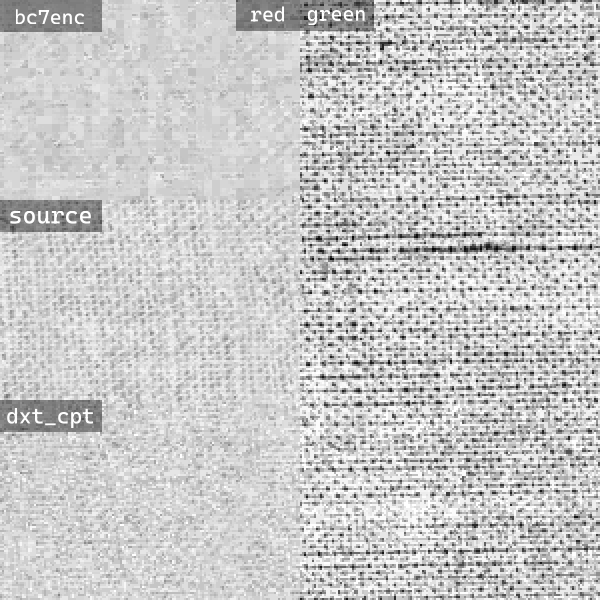
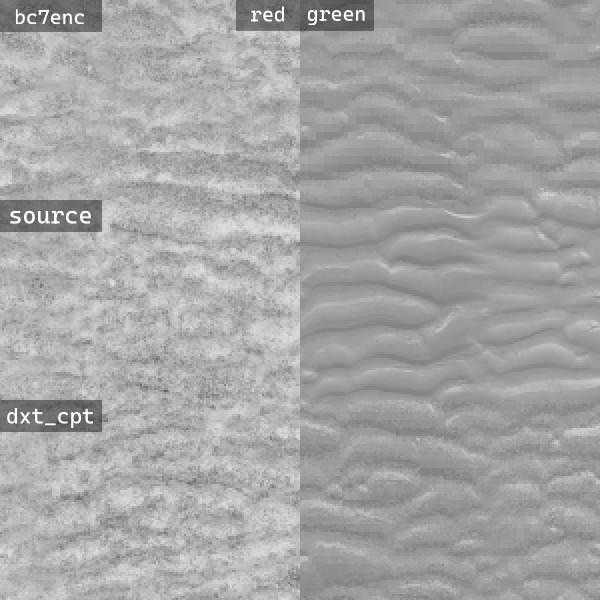
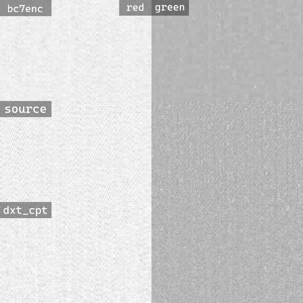
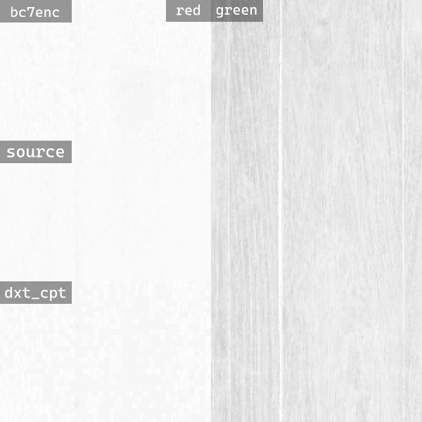
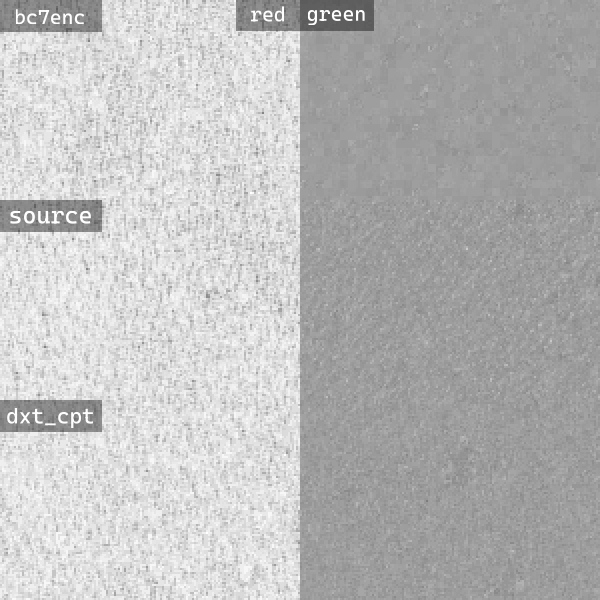
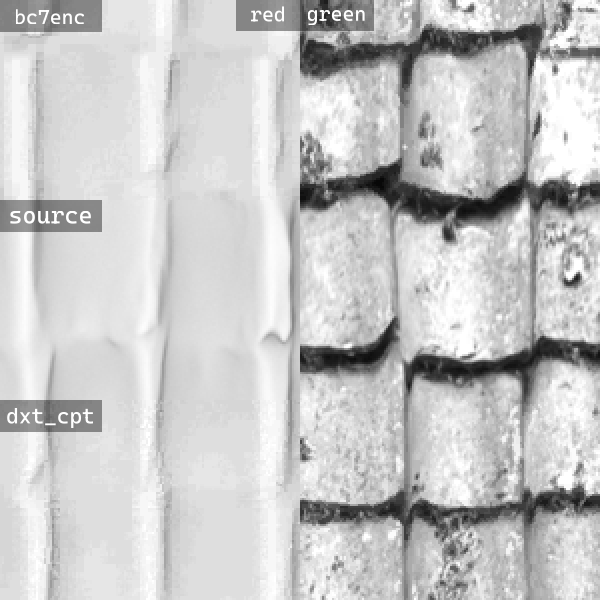

# dxt_cpt
A proof of concept BC1/DXT1/S3TC encoder for channel packed textures based on stb_dxt.

## Introduction
Most BC1 encoders treat textures as color images, optimizing for perceptual quality, which can lead to suboptimal results for channel packed textures, such as ARM/ORM (AO, Roughness, Metallic), where each channel is essentially a separate texture, resulting in detail loss on channels perpendicular to block's principal axis. This loss of detail manifests as single-value 4x4 pixel blocks.

This encoder is based around the assumption that leaking structural detail from one channel to another is preferrable to solid 4x4 blocks without any detail, and thus preserves detail on all channels.  

## Usage
```dxt_cpt [options] input.png [output.dds]```

Options:  
-mip - Generate mipmaps  

## Comparison to bc7enc
Encoder quality was evaluated on 761 1024x ARM textures from polyhaven.  
Bc7enc is used as the reference encoder as it seems to outperform all other available BC1 encoders (at least in 2020 benchmarks).
```
2026.06.15
SSIM (higher is better):
BC7ENC: 0.9399
DXTCPT: 0.9342

RMSE (lower is better):
BC7ENC: 4.0987
DXTCPT: 4.4580

LPIPS (lower is better):
BC7ENC: 0.0496
DXTCPT: 0.0453
```
Bc7enc encoding time is much longer compared to dxt_cpt as high-quality L18 mode is used.  
As you can see, bc7enc outperforms dxt_cpt on all traditional metrics, but loses (in 394 cases out of 761) on more modern LPIPS.

Here's 3 textures with best and worst results compared to bc7enc on LPIPS:
|3 Best textures|3 Worst textures|
|:---:|:---:|
|||
||
|||

See [benchmarks folder](/benchmarks/) for more data.
## Todo
Reduce endpoints quantization errors  
Try exhaustive endpoints search  
Support for regular color textures (?)  
Channel weighting  
Adaptive weighting (?)  
Try more ideas to reduce BC1 block artifacts
